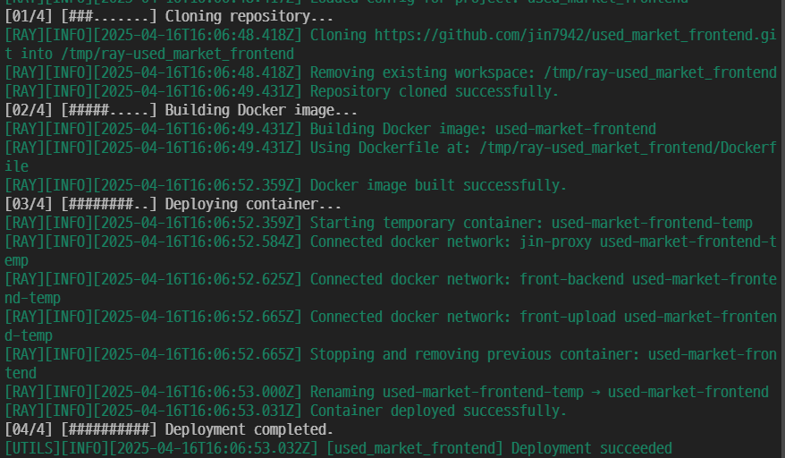

# RAY-AUTO-DEPLOY-SERVER



`RAY-AUTO-DEPLOY-SERVER`는 GitHub Webhook 이벤트를 수신하여, [RAY](https://github.com/jin7942/ray)를 기반으로 자동 배포를 수행하는 **경량 Node.js 서버**입니다.

## 주요 특징

-   **GitHub Webhook 연동**
    -   Push 이벤트를 수신하면 자동 배포 트리거
-   **RAY 연동**
    -   설정된 프로젝트 정보를 기반으로 클론 → 빌드 → 도커 배포 수행
-   **로그 및 배포 결과 저장**
    -   JSON 형식으로 배포 결과 저장
    -   `@jin7942/utils` 로깅 유틸리티 사용
-   **Express 기반 단순 구조**
    -   빠르게 이해하고 확장 가능
-   **도메인 및 프록시 환경 대응**
    -   프록시 환경에서도 배포 가능

---

## 디렉토리 구조

```bash
src/
├── routes/
│   └── webhook.ts          # GitHub Webhook 수신 및 검증
├── services/
│   └── deployService.ts    # runDeploy() - RAY 실행 및 상태 저장
├── utils/
│   └── verifySignature.ts  # 시그니처 검증 함수
├── _config/
│   └── constants.ts        # 환경변수 및 서버 설정 상수
└── server.ts               # 서버 진입점 (Express)
```

---

## 실행 방법

### 1. 의존성 설치

```bash
npm install
```

### 2. `.env` 파일 설정 (개발 환경에서만 필요)

```env
PORT=7979
GITHUB_SECRET=your_github_webhook_secret
```

### 3. 서버 실행

```bash
npm run dev
# 또는
npm start
```

---

## GitHub Webhook 설정

1. GitHub 저장소 Settings > Webhooks 접속
2. Payload URL: `https://YOUR_DOMAIN/webhook`
3. Content type: `application/json`
4. Secret: `.env`의 GITHUB_SECRET 값과 동일하게 설정
5. 이벤트: `Just the push event`
6. 저장

---

## 사용 기술

-   Node.js (Express)
-   TypeScript
-   raw-body (웹훅 raw payload 검증용)
-   RAY 자동배포 라이브러리 ([github.com/jin7942/ray](https://github.com/jin7942/ray))

---

## 결과 예시 (deploy-status.json)

```json
{
    "project": "ray",
    "status": "success",
    "startedAt": "2025-04-09T07:25:00.000Z",
    "endedAt": "2025-04-09T07:25:10.000Z",
    "durationSec": 10,
    "message": "Deployment successful",
    "logPath": "logs/2025-04-09.log"
}
```

---

## 기여 및 피드백

본 프로젝트는 오픈소스로 자유롭게 확장/수정이 가능합니다.  
기여 또는 피드백은 언제나 환영합니다.

---

## 라이선스

MIT License
